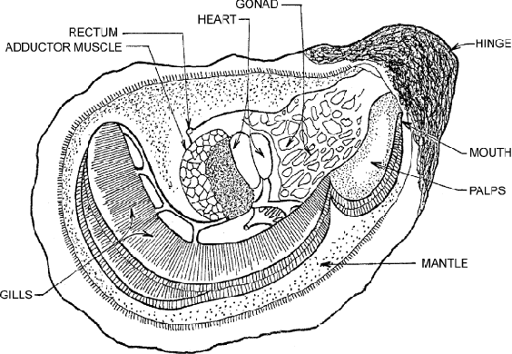

# Creative Data Visualization

## Project Description

For my creative data visualization I have decided to focus on my interest in oyster immune response to pathogens. In the state of Texas, we are seeing a rise in oyster farm leases as well as a rise in pathogen concentration and frequency in coastal waters. There is a growing concern in both industry and public health alike that oysters, who filter feed to obtain nutrients, will have a higher rate of pathogen uptake eventually leading to an increase in human cases due to consumption. *Perkinsus marinus* is one of the most dangerous pathogens that the Eastern Oyster, *Crassostrea virginica*, can be exposed to, causing extremely high rates of mortality. The dataset I chose comes from a publication on the transcriptomic response of the Eastern Oyster, particularly the identifitcation of novel immune strategies that assist in survival (Wang *et al*., 2010).

For the visualization component of my project, I plan to use a whittled sculpture of the Eastern Oyster's anatomy to create a heat map connecting genes to different organs, highlighting the internal changes across tissue types to pathogen exposure.

## Heat Map Coding

```{r}
#Loading my libraries
library(tidyverse)
library(pheatmap)
library(RColorBrewer)

#Loading in my data
f <- "https://raw.githubusercontent.com/carly-dempsey04/creative-data-visualization/refs/heads/main/datavisualization_data.csv"
d <- read_csv(f, col_names = TRUE)

#Preliminary attribute assignments
# ===============================
p_cutoff <- 0.05 #statistically significant
log2fc_cutoff <- 1 #relevant for gene expression change
top_n <- 50 #focusing visualization to most highest expression change

# Calculate log2 fold change (centering the log fold change around zero)
d1 <- d %>%
  mutate(
    log2FC = log2(`experiment mean` / `baseline mea`))

# Filter top 50 significant genes
sig_expr <- d1 %>%
  filter(
    `P value` <= p_cutoff,
    abs(log2FC) >= log2fc_cutoff
  ) %>%
  mutate(
    regulation = ifelse(log2FC > 0, "Upregulated", "Downregulated")) %>%
  slice_head(n = top_n)

# Aggregate duplicates (mean log2FC per gene) (necessary for heatmap package)
heatmap_mat <- sig_expr %>%
  group_by(EST_ID) %>%
  summarise(log2FC = mean(log2FC, na.rm = TRUE)) %>%
  column_to_rownames("EST_ID") %>%
  as.matrix()

#Setting heatmap color saturation limits
lim <- quantile(abs(heatmap_mat), 0.98)

#Generating row annotations
annotation_row <- sig_expr %>%
  select(EST_ID, regulation, `Gene Identification`) %>%
  distinct() %>%
  column_to_rownames("EST_ID")
#Row annotation colors
ann_colors <- list(
  regulation = c(
    Upregulated = "#E56399",
    Downregulated = "#0A2472"))

#Heatmap color palette (I gotchu Jamie with the pretty colors!)
heat_colors <- colorRampPalette(c("#0A2472", "white", "#E56399"))(100)

#Plot heatmap!!!
pheatmap(
  heatmap_mat,
  color = heat_colors,
  breaks = seq(-max(abs(heatmap_mat)), 
               max(abs(heatmap_mat)), 
               length.out = 101),
  cluster_rows = FALSE,
  cluster_cols = FALSE,
  annotation_row = annotation_row,
  fontsize_row = 8,
  annotation_colors = ann_colors,
  show_rownames = TRUE,
  cellwidth = 20,
  border_color = NA,
  fontsize_col = 10,
  fontsize = 8,
  main = expression(
    "Differential Gene Expression Of C. virginica after P. marinus challenge"
  )
)
```

## Creative Visualization

For this project, I would choose to represent differential gene expression as it relates to an oyster's body plan, linking gene IDs with associated tissue. For example:

- Hepatitis b virus x interacting protein: adductor muscle associated with hemolymph immune response.

- Calcium binding EF-hand protein: mantle cavity that secretes calcium for shell-formation.

#### Whittling (<https://youtu.be/1o3jOjFiPC0?si=Ulf7l4CwC2thFfRv>)

An art form and creative relaxation technique, wood whittling has become a favorite craft of mine in my graduate program. Enabling me to create figures of subject species and share them with collaborators and labmates. For this project I would use a jigsaw to cut out the outline shape of an oyster (Figure 1) from basswood and then carve out the organs/tissue types commonly depicted in oyster anatomical diagrams (Figure 2).

#### Painting

Hues of magenta would be used to represent upregulated genes and navy blue for downregulated. Hypothetically, I would use my own dataset (currently under production) that would have specific immune genes already observed to be significantly downregulated after exposure to previous contaminants. This would, hypothetically, produce a vibrant scene depicting just how interesting and responsive an oyster's immune system is.

#### Inspiration Images

```{r}
#| out-width: "70%" 
knitr::include_graphics("DataVisualizationFig1.avif")
```

```{r}
#| out-width: "70%" 

```

### Citation

Proestou, D. A., & Sullivan, M. E. (2020). Variation in global transcriptomic response to *Perkinsus marinu*s infection among eastern oyster families highlights potential mechanisms of disease resistance. *Fish & Shellfish Immunology*, *96*, 141–151. https://doi.org/10.1016/j.fsi.2019.12.001
